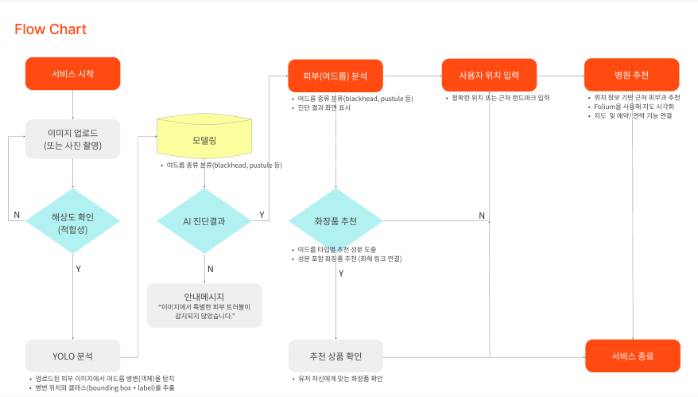
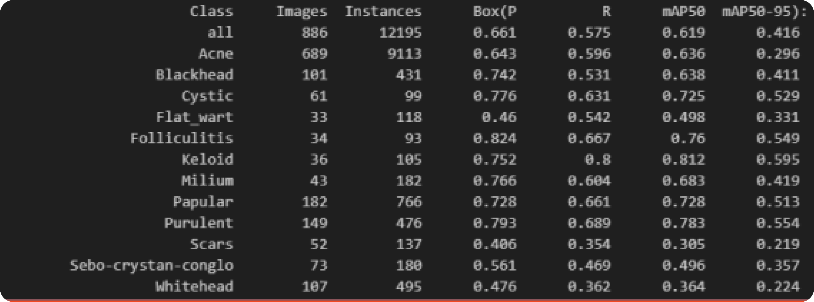

***
# 프로젝트 기획서

## 1. 프로젝트 정의

- **목표**: 스마트폰 카메라로 촬영/업로드한 피부 이미지를 YOLO 기반 AI 모델로 분석하여 여드름 종류를 판별하고, 맞춤 성분, 화장품 추천 및 위치기반 근처 피부과 예약 연결까지 제공
- **주요 기능**:
    - 피부 이미지 수집 및 전처리
    - YOLO 모델 기반 여드름  종류 판별
        - 여드름 종류 설명
            - **여드름 (Acne)**
                - **해석:** 피지선과 모낭에 발생하는 만성 염증성 질환으로, 다양한 형태의 발진이 나타나는 가장 흔한 피부 문제입니다.
                - **특징:** 면포, 구진, 농포, 결절 등 다양한 형태가 동시에 나타날 수 있으며 주로 얼굴, 목, 가슴, 등에 발생합니다.
            - **구진 (Papular)**
                - **해석:** 피부에 붉게 솟아오른 작고 단단한 발진을 의미하며, 보통 염증의 초기 단계에서 나타납니다.
                - **특징:** 붉은 기를 띠며 만졌을 때 단단함이 느껴지지만, 아직 고름은 잡히지 않은 상태입니다.
            - **백헤드 (Whitehead)**
                - **해석:** 모공이 막혀 피지가 피부 밖으로 나오지 못하고 갇혀있는 상태로, '폐쇄 면포'라고도 불립니다.
                - **특징:** 좁쌀처럼 오돌토돌하게 튀어나와 있으며, 염증이 없어 통증이나 붉은 기는 거의 없습니다.
            - **농포 (Purulent)**
                - **해석:** 염증 반응으로 인해 병변 내부에 고름(농)이 차 있는 상태의 여드름을 말합니다.
                - **특징:** 중심부에 노란 고름이 보이며, 만지면 통증이 느껴지고 잘못 짜면 흉터가 남기 쉽습니다.
            - **블랙헤드 (Blackhead)**
                - **해석:** 모공 속 피지가 피부 표면으로 노출되어 공기와 만나 산화되면서 검게 변한 상태입니다.
                - **특징:** 비염증성 여드름의 일종으로, 코 주변에 흔히 발생합니다. 의학적으로는 ‘개방 면포’라고 부릅니다.
            - **밀리움 (Milium)**
                - **해석:** 피부 표면 가까이에 생긴 작고 흰색 또는 노란색의 각질 주머니로, 흔히 '비립종'이라고 불립니다.
                - **특징:** 주로 눈가나 뺨처럼 피부가 얇은 부위에 발생하며, 단단한 각질 덩어리라 짜기 어렵습니다.
            - **피지결정성 응고 (Sebo-crystan-conglo)**
                - **해석:** 여러 개의 염증성 결절이나 낭종이 뭉쳐서 나타나는 심각한 형태의 여드름입니다.
                - **특징:** 여러 염증이 서로 합쳐져 크고 불규칙한 모양을 이루며, 심한 흉터를 남길 수 있는 중증 여드름입니다.
            - **흉터 (Scars)**
                - **해석:** 피부 손상 후 치유 과정에서 정상적인 피부 조직 대신 섬유 조직이 대체되어 남는 흔적입니다.
                - **특징:** 붉은 자국, 색소 침착, 혹은 피부가 패이거나 튀어나오는 등 다양한 형태로 나타납니다.
            - **편평사마귀 (Flat wart)**
                - **해석:** 인유두종 바이러스(HPV) 감염에 의해 발생하는 작고 평평한 모양의 사마귀입니다.
                - **특징:** 표면이 편평하고 정상 피부보다 살짝 솟아 있으며, 주로 이마, 턱, 코, 손등에 여러 개가 동시에 나타납니다.
            - **켈로이드 (Keloid)**
                - **해석:** 상처 치유 과정에서 콜라겐이 비정상적으로 과다 증식하여 원래 상처보다 크고 붉게 튀어나오는 흉터입니다.
                - **특징:** 단단하고 표면이 불규칙하며, 가렵거나 따가운 통증을 동반할 수 있습니다. 상처 범위를 넘어 주변으로 자라는 경향이 있습니다.
            - **낭포성 여드름 (Cystic)**
                - **해석:** 피부 깊은 곳에 주머니 모양의 결절이 형성되는 심한 염증성 여드름입니다.
                - **특징:** 크기가 크고 피부 깊숙이 자리 잡아 통증이 심하며, 붉거나 보라색을 띨 수 있습니다. 영구적인 흉터를 남길 가능성이 매우 높습니다.
            - **모낭염 (Folliculitis)**
                - **해석:** 세균이나 곰팡이 감염으로 인해 모낭(털을 감싸는 주머니)에 염증이 생기는 질환입니다.
                - **특징:** 털이 있는 부위라면 어디든 발생할 수 있으며, 붉은 발진 중심에 털이 있고 작은 고름점을 동반하는 경우가 많습니다.
    - 진단 결과 보고
    - 피부타입 별 맞춤 성분 화장품 추천 및 피부과 예약 연동

## 2. 주요 내용

- **프로젝트 기간**: 2025-09-12 ~  2025-09-23
- **참여 인원**: 윤지혜, 이남경, 윤희상
- **데이터 출처**:
    - **Kaggle Acne Dataset** (공개 여드름 데이터셋)
    - **Roboflow Universe – Acne Dataset** (https://universe.roboflow.com/project-pcw5n/acne-6rzah)
    - **전국 의료기관 표준데이터** (공공데이터포털 제공)

## 3. 일정 계획

| 작업 항목 | 시작 날짜 | 종료 날짜 | 기간(일) |
| --- | --- | --- | --- |
| 착수 회의 (기획서, WBS 검토) | 2025-09-12 | 2025-09-12 | 1 |
| 데이터 요구사항 정의 | 2025-09-13 | 2025-09-13 | 1 |
| 데이터 수집 및 전처리 | 2025-09-14 | 2025-09-16 | 3 |
| YOLO 모델 학습 및 튜닝 | 2025-09-17 | 2025-09-19 | 3 |
| 결과 도출 및 모델 평가 | 2025-09-20 | 2025-09-21 | 2 |
| UI/UX 적용 및 통합 테스트 | 2025-09-22 | 2025-09-22 | 1 |
| 최종 검토 및 프로젝트 발표 | 2025-09-23 | 2025-09-23 | 1 |

---

# 작업 분할 구조 (WBS)

## 1. 단계별 작업 구성

### 1. 기획

1.1. 문제 정의 

1.2. 프로젝트 범위 정의

1.3. 데이터 요구사항 정의

1.4. 자료조사(경쟁 서비스 벤치마킹 등)

### 2. 데이터 수집 및 준비

2.1. 여드름 이미지 데이터셋 수집 및 조사

2.2. 여드름 피부 타입별 약 종류 테이터셋, Kaggle/병원 제휴 데이터 수집 및 저장

2.3. YOLO 학습용 어노테이션 및 전처리

### 3. 데이터 분석 및 모델링

3.1. 데이터 탐색 

3.2. YOLO 모델 학습 및 하이퍼파라미터 튜닝

3.3. 성능 평가 (mAP50, mAP50-95, Precision, Recall)

### 4. 결과 도출 및 보고

4.1. 결과 요약 및 대시보드 시각화

4.2. 보고서 작성 (진단 정확도, 추천 매핑 결과 포함)

4.3. 최종 발표

---

# 요구사항 정의서

## 1. 기능 요구사항

- 피부 이미지 데이터를 수집하고 YOLO 기반 모델로 분석 가능해야 함
- 여드름 종류 판별 및 맞춤 성분 화장품 추천 매핑
- 피부과 정보 버튼(홈페이지/전화/지도 연동) 제공

## 2. 비기능 요구사항

- 처리 성능: AI 판별 결과를 3초 이내 제공
- 면책 조항: "본 서비스는 의료적인 진단을 대체할 수 없으며, 참고용으로만 활용해야 합니다.”
- 확장성: 여드름 외 피부 질환(습진, 피부암 등) 데이터 추가 가능

---

# 프로젝트 설계서

## 1. 데이터 아키텍처

- **설계 개요**:
    - 데이터 수집: Kaggle, Roboflow, 의료기관 표준데이터
    - 분석 및 시각화: YOLOv8 + FastAPI API, Streamlit Dashboard

## 2. 기술 스택

- 데이터 수집: Python, OpenCV, Labeling, API 연동
- 분석 및 처리: YOLOv8 (PyTorch), Pandas, NumPy
- 시각화: Matplotlib, Seaborn, Streamlit, React.js (프론트)

## 3. 설계 이미지

---

# 데이터 연동 정의서

## 1. 데이터 정의

- 데이터 소스: Kaggle Acne Dataset, Roboflow Universe – Acne Dataset, 전국 의료기관 표준데이터
- 주요 컬럼:
    - image_id: 이미지 ID
    - user_id: 사용자 ID
    - acne_type: 여드름 종류
    - recommendation: 추천 화장품 매핑

## 2. 수집 방식

- **연동 방식**: Kaggle 및 Roboflow에서 공개된 데이터셋 직접 다운로드, 공공데이터포털(전국 의료기관 표준데이터)에서 파일 다운로드
- **수집 주기**: 프로젝트 단일 수집 (필요 시 최신 버전 데이터셋 재다운로드)

---

# 시각화 리포트

## 1. 분석 결과 요약

- **탐지 성능:** YOLO 모델 기반 여드름 탐지 후 분류 정확도
    - 전체 mAP50: **61.9%**, mAP50-95: **41.6%**
- **클래스별 특징:**
    - 비교적 특징이 뚜렷한 농포 (Purulent), Papular(구진)에서 높은 탐지 성능(mAP50 약 0.78 이상) 확보
    - 데이터 수가 적은 클래스(Cystic, Milium 등)에서는 상대적으로 낮은 성능
- **의미 있는 패턴:**
    - 여드름 종류별 탐지 성능 편차 확인 → **데이터 불균형 보완 필요**
    - 성능이 높은 클래스는 추천 성분 매칭에 활용 가능성이 높음
- **활용 가능성:**
    - 탐지 결과 기반 성분 추천 및 피부과 연동 → 사용자의 행동 전환율(약 65%)로 이어질 가능성 확인
- **성능 지표:**

## 2. 대시보드

## 3. 제안

- 피부과 예약 CTA 강화
- 화장품 제휴사와 맞춤형 마케팅 캠페인 추진

***

# 프로젝트 회고

## 1. 프로젝트 개요

- **프로젝트 이름**: AcneCheck AI – YOLO 기반 피부 진단 플랫폼
- **기간**: 2025-09-12 ~ 2025-09-23
- **팀 구성원**: 윤지혜, 이남경, 윤희상

---

## 2. 회고 주제

### 2.1. 잘한 점 (What went well)

- **All-in-One 솔루션** 구현 : 단순 분석을 넘어 화장품 정보(화해), 병원 위치(카카오맵)까지 연계하여 실제 행동으로 이어지는 서비스를 구축함.
- **모델 성능 개선** : CNN보다 YOLO가 탐지 속도·정확도에서 우수함을 실증, 데이터 정제·증강·모델 변경(n→s) 등 다양한 시도를 통해 mAP를0.46 → 0.619까지 향상시킴.
- 문제 해결 능력 : 403 Forbidden, FileNotFoundError 등 개발 중 발생한 **오류를 체계적으로 추적·해결함. 로컬 환경과 클라우드 배포 환경의 차이를 이해하고 문제 해결 능력 향상**
- 시장 전략 실행 : 기존 서비스들이 방대한 기능을 제공하는 반면,여드름 분석에만 집중하여 **니치시장 공략의 차별화 가능성을 확인**함.

---

### 2.2. 개선이 필요한 점 (What could be improved)

- **모델 성능 한계**: 최종 (mAP50-95 0.416)은 프로토타입으로 의미 있었으나,실제 서비스 신뢰도를 확보하기에는 부족함.
- **데이터 불균형**: 소수 클래스(흉터 , 화이트헤드 등) 데이터가 부족해 해당 질환 탐지 성능이 낮음.
- **UI/UX 보완 필요**: 현재는 기능 구현 중심으로 진행되어,사용자 위치 좌표 자동 인식 등 편의성을 높이는 개선점이 남아 있음.
- 법적 제약: 약품 추천은 규제로 인해 불가능하므로, 향후 기획 단계에서는 반드시 이러한 **법적 제약에 대한 사전 검토**가 필요함.

---

### 2.3. 배운 점 (Lessons learned)

- 데이터 품질의 중요성: AI 모델 성능은 데이터의 정확성과 균형성에 크게 좌우되며, 클래스 증강의 필요성을 실감함.
- API 연동의 가치: 카카오맵 · 화해 등 **외부 서비스와 연동이 서비스의 실용성과 확장성을 높임**을 경험함.
- **단계별 검증** 필요성: 전체 코드를 한 번에 실행하기보다, 모델 검증·API 호출 등 기능 단위로 나눠 테스트하는 것이 오류 해결에 효과적임.
- 실현 가능성 검토: 기술·법규·사용자 측면에서 **아이디어의 타당성을 다각도로 검토하는 것이 필수적임을 학습함.**

---

### 2.4. 다음 단계 (Action items)

- 피부 질환 데이터셋 추가 확보 (습진, 피부암 등)
- 예약 시스템 직접 연동 모듈 개발 검토

---

## 3. 팀원별 피드백

- **팀원 A**
    - **강점**: YOLO 모델 학습 및 하이퍼파라미터 최적화에 뛰어난 역량
    - **개선점**: 코드 리뷰 시 구체적인 개선 방안 제시가 더 필요함
- **팀원 B**
    - **강점**: 데이터 전처리 및 데이터 증강 과정에서 높은 정확도 상승 발휘
    - **개선점**: 모델 학습 과정 및 결과를 팀 내에 더 체계적으로 공유할 필요 있음
- **팀원 C**
    - **강점**: 카카오API가 그나마 구글이나 네이버보다는 조금더 활용하기 용이하고 접근하기편하다
    - **개선점**: 업무 진행 상황을 자주 공유하면 협업 효율이 높아질 것

---

## 4. 프로젝트 주요 결과 요약

- **성과**:
    - YOLOs8-obb 기반 피부 진단 모델 정확도 62% 달성
    - 대시보드 및 보고서 기능 구현 완료
- **결과물**:
    - ([https://kpmg6-2ndproject-acnecheck.streamlit.app](https://kpmg6-2ndproject-acnecheck.streamlit.app/))
***
